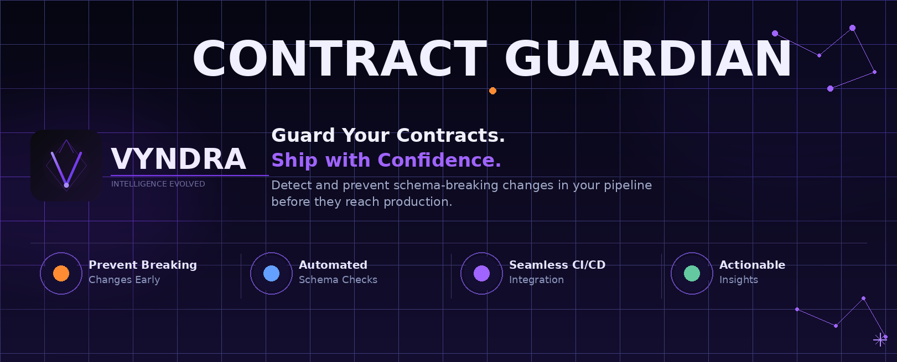

# Contract Guardian



Catch breaking schema changes before they reach production. Contract Guardian scans pull requests for backward-incompatible changes across Kafka schemas (Avro, JSON Schema, Protobuf), REST API contracts (OpenAPI), and database schemas (SQL migrations, JPA entities, JSONB columns) — and fails the build when it finds them.

```
$ contract-guardian scan --diff origin/main..HEAD

  BREAKING  schemas/kafka/avro/payment-value.avsc
    Field "customer_id" removed — breaks backward compatibility
    Fix: Add a default value to the field before removing it

  BREAKING  api/openapi/catalog-service.yaml
    Endpoint removed: POST /products — existing callers will break

  WARNING   schemas/kafka/proto/order-event.proto
    Field 'status' (tag 4) removed without reserved declaration

  PASS      schemas/kafka/json/user-preferences.json

  Result: FAIL — 2 breaking, 1 warning, 1 pass
```

---

## Quick Start

**Requirements:** Java 17+, Git

**1. Build:**

```bash
git clone https://github.com/vyndra-io/contract-guardian.git
cd contract-guardian
mvn package -DskipTests
alias contract-guardian='java -jar contract-guardian-cli/target/contract-guardian-cli-1.0.0.jar'
```

**2. Initialize config in your project:**

```bash
cd /path/to/your/project
contract-guardian init
```

`init` auto-detects `.avsc`, `.json`, `.proto`, and `.yaml` files and writes a `.contract-guardian.yml` with sensible defaults.

**3. Scan for breaking changes:**

```bash
contract-guardian scan --diff origin/main..HEAD
```

---

## Documentation

| I want to... | Go to |
|---|---|
| Scan Apache Avro schemas (`.avsc`) on Kafka | [Kafka Avro Scanner](docs/scanner-kafka-avro.md) |
| Scan JSON Schema files (`.json`) on Kafka | [Kafka JSON Schema Scanner](docs/scanner-kafka-json-schema.md) |
| Scan Protobuf schemas (`.proto`) on Kafka | [Kafka Protobuf Scanner](docs/scanner-kafka-protobuf.md) |
| Scan OpenAPI spec files (`.yaml`, `.json`) | [REST OpenAPI Scanner](docs/scanner-rest-openapi.md) |
| Scan Spring or JAX-RS controllers with annotations | [REST OpenAPI Scanner — Annotations](docs/scanner-rest-openapi.md#java-annotation-based-projects) |
| Scan Flyway or raw SQL migration files | [Database SQL Scanner](docs/scanner-db-sql.md) |
| Scan JPA / Hibernate entity classes | [Database JPA Scanner](docs/scanner-db-jpa.md) |
| Scan Liquibase changelog files | [Database Liquibase Scanner](docs/scanner-db-liquibase.md) |
| Mix multiple schema types in one repo | [Configuration Reference](docs/configuration.md) |
| Integrate with GitHub Actions, GitLab CI, or Docker | [CI Integration](docs/ci-integration.md) |
| Post findings to a GitHub PR or GitLab MR | [Reporters](docs/reporters.md) |
| Run validation at Maven build time | [Maven Plugin](docs/maven-plugin.md) |
| Understand what counts as a breaking change | [Breaking and Non-Breaking Changes](docs/breaking-changes.md) |

---

## What Gets Scanned

| File type | Scanner | Module |
|---|---|---|
| `.avsc` | Kafka Avro — Apache Avro `SchemaCompatibility` | `contract-guardian-kafka` |
| `.json` (JSON Schema) | Kafka JSON Schema — structural diff with Jackson | `contract-guardian-kafka` |
| `.proto` | Kafka Protobuf — Square Wire schema parser | `contract-guardian-kafka` |
| `.yaml` / `.json` (OpenAPI 3.x) | REST OpenAPI — openapi-diff | `contract-guardian-rest` |
| `.sql` (Flyway / raw migrations) | Database SQL — DDL parsing with JSqlParser | `contract-guardian-db` |
| `.xml` / `.yaml` (Liquibase changelogs) | Database Liquibase — structural changelog diff | `contract-guardian-db` |
| Java entity classes (`@Entity`, `@Column`) | Database JPA — annotation scanning with JavaParser | `contract-guardian-db` |

Scanners are discovered via Java `ServiceLoader`. A new scanner type is a single JAR on the classpath.

---

## Configuration

A minimal `.contract-guardian.yml`:

```yaml
version: "1"

sources:
  kafka:
    paths:
      - "schemas/**/*.avsc"
    baseline: branch:main

rules:
  kafka:
    compatibility: BACKWARD

gate:
  block-on: breaking
```

Full reference: [Configuration Reference](docs/configuration.md)

---

## CLI Reference

```
contract-guardian scan     --diff <git-ref> [options]   Scan for breaking changes
contract-guardian init     [--working-dir <path>]        Generate starter config
contract-guardian validate [--config <path>]             Validate config syntax
```

### scan options

| Option | Short | Required | Default | Description |
|---|---|---|---|---|
| `--diff <ref>` | `-d` | Yes | — | Git diff spec, e.g. `origin/main..HEAD` |
| `--config <path>` | `-c` | No | `.contract-guardian.yml` | Config file |
| `--reporter <spec>` | `-r` | No | `terminal` | `terminal` or `junit:<path>`. Repeatable. |
| `--github-pr <spec>` | — | No | — | Post to GitHub PR. Format: `owner/repo#123` |
| `--gitlab-mr <spec>` | — | No | — | Post to GitLab MR. Format: `project/path!123` |
| `--working-dir <path>` | `-w` | No | `.` | Git repository root |

### Exit codes

| Code | Meaning |
|---|---|
| `0` | Passed — no blocking findings |
| `1` | Failed — breaking changes detected |

---

## Docker

```bash
docker build -t contract-guardian .

docker run --rm \
  -v $(pwd):/workspace -w /workspace \
  contract-guardian scan --diff origin/main..HEAD
```

---

## Examples

The [`examples/multi-contract/`](examples/multi-contract/) directory contains a fictional payment service with all four schema types and pre-made breaking/safe scenarios. It is the fastest way to see the tool in action.

---

## Architecture

See [Architecture](docs/architecture.md) for the module layout, core data model, scanner interface, and how to write a custom scanner.

---

## License

AGPL 3.0 — see [LICENSE](LICENSE).
